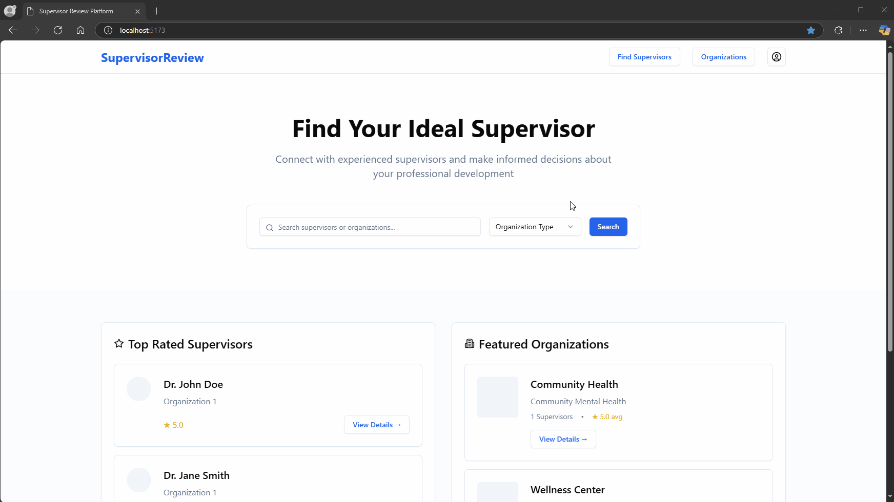
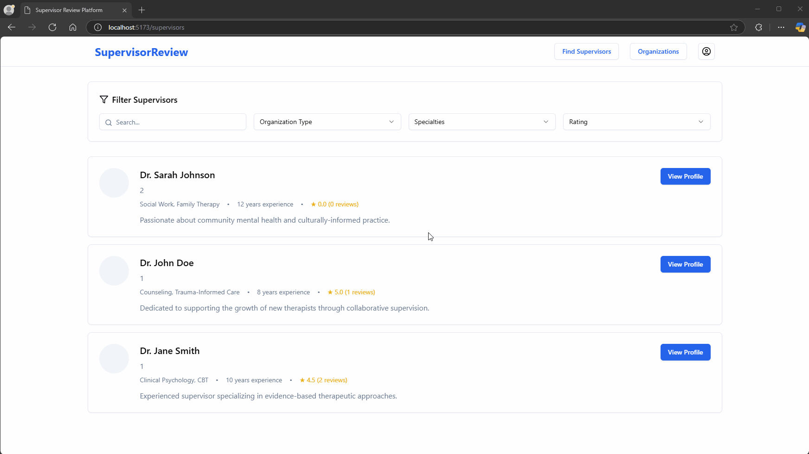

# Rate My Supervisor

CodePath WEB103 Final Project

Designed and developed by: Alexandre Steinhauslin, Shi Zhang, Timothy Chung

🔗 Link to deployed app:

## About

### Description and Purpose

Rate my Supervisor is a web application like Rate my Professor that allows Intern and Associate therapists to rate their supervisor.

### Inspiration

The current state of the internship/apprenticeship environment in the state of California.

## Tech Stack

Frontend: React, Tailwind CSS

Backend: Node.js, Express, PostgreSQL, Railway

## Features

### ✅ View List of Organizations and Supervisors

Users can browse a comprehensive list of organizations and their associated supervisors to explore available options and read reviews.

### ✅ View Reviews for Organizations and Supervisors

Users can see a list of reviews for a particular supervisor or an organization.

### ✅ Add Reviews for Organizations and Supervisors

Users can add reviews for a particular supervisor or an organization.

### ✅ Review Tags for Supervisors

When submitting reviews for a supervisor, interns can select from predefined tags to highlight specific aspects of their experience, making it easier for others to identify key points.

### Search for Organizations and Supervisors

A search functionality which allows users to quickly find specific organizations or supervisors by name.

[gif goes here]

### Update Organizations and Supervisors

Users can edit existing profiles of organizations and supervisors to ensure information remains accurate and up-to-date.

[gif goes here]

## Installation Instructions

[instructions go here]
