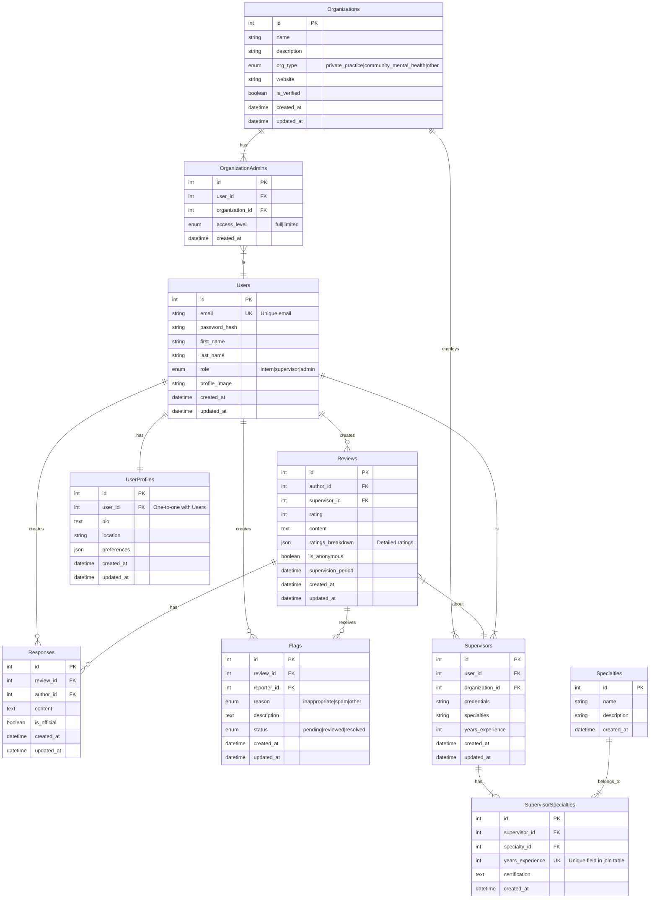

# Entity Relationship Diagram

Reference the Creating an Entity Relationship Diagram final project guide in the course portal for more information about how to complete this deliverable.

## Create the List of Tables

1. **Users**

   - Core table storing all user information (interns, supervisors, administrators)
   - One-to-many relationship with Reviews, Responses, and Flags
   - One-to-one relationship with UserProfiles

2. **UserProfiles**

   - Extended user information storage
   - One-to-one relationship with Users
   - Stores additional user preferences and details

3. **Organizations**

   - Information about mental health practices and centers
   - One-to-many relationship with Supervisors and OrganizationAdmins
   - Supports organization type categorization

4. **OrganizationAdmins**

   - Junction table connecting Users and Organizations for administrative roles
   - Manages organization-level permissions

5. **Supervisors**

   - Extended information for supervisor-type users
   - Connected to Organizations and Users
   - Many-to-many relationship with Specialties

6. **Specialties**

   - Catalog of supervision specialties
   - Many-to-many relationship with Supervisors through SupervisorSpecialties

7. **SupervisorSpecialties**

   - Junction table connecting Supervisors and Specialties
   - Includes unique field for years of experience in specialty

8. **Reviews**

   - Stores supervision feedback and ratings
   - Connected to both Users (authors) and Supervisors

9. **Responses**

   - Allows for responses to reviews
   - Connected to Reviews and response authors

10. **Flags**
    - Supports content moderation
    - Connected to Reviews and reporting users

## Detailed Table Specifications

### Users Table

| Column Name   | Type     | Description                         |
| ------------- | -------- | ----------------------------------- |
| id            | integer  | Primary key                         |
| email         | string   | Unique email address                |
| password_hash | string   | Encrypted password                  |
| first_name    | string   | User's first name                   |
| last_name     | string   | User's last name                    |
| role          | enum     | User role (intern/supervisor/admin) |
| profile_image | string   | Profile image URL                   |
| created_at    | datetime | Record creation timestamp           |
| updated_at    | datetime | Record update timestamp             |

### UserProfiles Table

| Column Name | Type     | Description               |
| ----------- | -------- | ------------------------- |
| id          | integer  | Primary key               |
| user_id     | integer  | Foreign key to Users      |
| bio         | text     | User biography            |
| location    | string   | User location             |
| preferences | json     | User preferences          |
| created_at  | datetime | Record creation timestamp |
| updated_at  | datetime | Record update timestamp   |

### Organizations Table

| Column Name | Type     | Description                                           |
| ----------- | -------- | ----------------------------------------------------- |
| id          | integer  | Primary key                                           |
| name        | string   | Organization name                                     |
| description | text     | Organization description                              |
| org_type    | enum     | Type (private_practice/community_mental_health/other) |
| website     | string   | Organization website                                  |
| is_verified | boolean  | Verification status                                   |
| created_at  | datetime | Record creation timestamp                             |
| updated_at  | datetime | Record update timestamp                               |

### Supervisors Table

| Column Name      | Type     | Description                     |
| ---------------- | -------- | ------------------------------- |
| id               | integer  | Primary key                     |
| user_id          | integer  | Foreign key to Users            |
| organization_id  | integer  | Foreign key to Organizations    |
| credentials      | string   | Professional credentials        |
| specialties      | string   | Areas of expertise              |
| years_experience | integer  | Years of supervision experience |
| created_at       | datetime | Record creation timestamp       |
| updated_at       | datetime | Record update timestamp         |

### Reviews Table

| Column Name        | Type     | Description                  |
| ------------------ | -------- | ---------------------------- |
| id                 | integer  | Primary key                  |
| author_id          | integer  | Foreign key to Users         |
| supervisor_id      | integer  | Foreign key to Supervisors   |
| rating             | integer  | Overall rating score         |
| content            | text     | Review content               |
| ratings_breakdown  | json     | Detailed ratings by category |
| is_anonymous       | boolean  | Anonymous posting flag       |
| supervision_period | datetime | Period of supervision        |
| created_at         | datetime | Record creation timestamp    |
| updated_at         | datetime | Record update timestamp      |

### SupervisorSpecialties Table

| Column Name      | Type     | Description                       |
| ---------------- | -------- | --------------------------------- |
| id               | integer  | Primary key                       |
| supervisor_id    | integer  | Foreign key to Supervisors        |
| specialty_id     | integer  | Foreign key to Specialties        |
| years_experience | integer  | Unique field - years in specialty |
| certification    | text     | Relevant certifications           |
| created_at       | datetime | Record creation timestamp         |

### Flags Table

| Column Name | Type     | Description                            |
| ----------- | -------- | -------------------------------------- |
| id          | integer  | Primary key                            |
| review_id   | integer  | Foreign key to Reviews                 |
| reporter_id | integer  | Foreign key to Users                   |
| reason      | enum     | Flag reason (inappropriate/spam/other) |
| description | text     | Detailed description                   |
| status      | enum     | Status (pending/reviewed/resolved)     |
| created_at  | datetime | Record creation timestamp              |
| updated_at  | datetime | Record update timestamp                |

This schema implements:

- One-to-one relationship between Users and UserProfiles
- One-to-many relationship between Organizations and Supervisors
- Many-to-many relationship between Supervisors and Specialties (with unique field)
- Comprehensive support for data validation and filtering
- Full CRUD operation support through RESTful API endpoints

## Add the Entity Relationship Diagram

The diagram above illustrates:

1. **Core Relationships**

   - Users ↔ UserProfiles (One-to-One)
   - Organizations ↔ Supervisors (One-to-Many)
   - Supervisors ↔ Specialties (Many-to-Many through SupervisorSpecialties)

2. **Review System**

   - Users create Reviews for Supervisors
   - Reviews can receive Responses
   - Reviews can be flagged for moderation

3. **Organization Management**

   - Organizations have multiple Supervisors
   - Organizations have Administrators
   - Supervisors have specific Specialties

4. **Key Features**
   - Unique email constraint for Users
   - Unique years_experience field in SupervisorSpecialties join table
   - Comprehensive timestamp tracking
   - Enumerated types for roles and statuses
